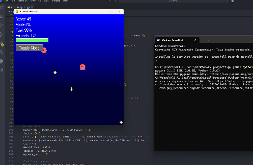

# RL Space Adventure 🛸

[](https://youtu.be/-SEVWrDj25g)

A Pygame-based, space-themed reinforcement learning game where players control a spaceship to collect stars while avoiding asteroids and managing fuel.

## Features

- **Dual Control Modes**: Manual control with arrow keys or watch the AI learn through reinforcement learning
- **Q-Learning Implementation**: AI agent learns optimal strategies using discretized state spaces
- **Real-time Visualization**: Watch the agent improve episode by episode
- **Fuel Management**: Strategic gameplay element requiring fuel conservation
- **Professional Architecture**: Modular, object-oriented design with comprehensive documentation

## Game Mechanics

- **Objective**: Collect yellow stars while avoiding red asteroids
- **Controls**:
  - **Manual Mode**: Arrow keys to move (↑↓←→)
  - **RL Mode**: Watch the AI agent learn and play autonomously
- **Fuel System**: Each move consumes fuel, collecting stars restores fuel
- **Scoring**: Points awarded for collecting stars
- **Episodes**: Game resets when fuel depletes or collision occurs

## Technical Details

### State Space
The RL agent uses a discretized state representation including:
- Player position (x, y coordinates)
- Fuel level
- Distance to nearest star (Δx, Δy)
- Distance to nearest asteroid (Δx, Δy)

### Q-Learning Parameters
- **Learning Rate (α)**: 0.1
- **Discount Factor (γ)**: 0.95
- **Exploration Rate**: Starts at 0.2, decays to 0.01
- **Actions**: Stay, Move Up, Move Down, Move Left, Move Right

### Rewards
- **Fuel Consumption**: -0.1 per move
- **Star Collection**: +20 points + fuel restoration
- **Asteroid Collision**: -50 points
- **Fuel Depletion**: -100 points

## Installation

### Prerequisites
- Python 3.7+
- pip package manager

### Install from Source
```bash
git clone <repository-url>
cd rl-space-adventure
pip install -r requirements.txt
```

### Install as Package
```bash
pip install -e .
```

## Usage

### Running the Game
```bash
# From the project root
python -m src.rl_space_adventure

# Or if installed as package
rl-space-adventure
```

### Game Controls
- **Mouse**: Click "Toggle Mode" button to switch between Manual and RL modes
- **Manual Mode**:
  - ↑: Move up
  - ↓: Move down
  - ←: Move left
  - →: Move right
- **RL Mode**: Sit back and watch the AI learn!

### HUD Information
- **Score**: Current points earned
- **Mode**: Manual or RL control
- **Fuel**: Remaining fuel percentage
- **Episode**: Current training episode number

## Project Structure

```
rl-space-adventure/
├── src/
│   └── rl_space_adventure/
│       ├── __init__.py          # Package initialization
│       ├── __main__.py          # Entry point
│       ├── config.py            # Game constants and configuration
│       ├── game.py              # Main game logic and entity classes
│       ├── rl_agent.py          # Q-learning agent implementation
│       └── rendering.py         # Display and drawing functions
├── assets/                      # Game assets (images, etc.)
├── tests/                       # Unit tests
├── docs/                        # Documentation
├── requirements.txt             # Python dependencies
├── setup.py                     # Package setup script
├── .gitignore                   # Git ignore patterns
└── README.md                    # This file
```

## Architecture

### Core Classes

- **`SpaceAdventureGame`**: Main game controller managing game loop and state
- **`RLAgent`**: Q-learning agent with state discretization and action selection
- **`Renderer`**: Handles all drawing operations and UI rendering
- **`Player`**: Spaceship entity with position and fuel management
- **`Coin`**: Collectible star entities
- **`Enemy`**: Asteroid entities with AI movement

### Key Features

- **Modular Design**: Separated concerns for maintainability
- **Object-Oriented**: Clean class hierarchy with inheritance
- **Configurable**: Easy parameter tuning through config module
- **Extensible**: Simple to add new features or modify gameplay

## Development

### Running Tests
```bash
python -m pytest tests/
```

### Code Style
```bash
# Format code
black src/

# Lint code
flake8 src/

# Type checking
mypy src/
```

### Adding New Features
1. Create new entity classes inheriting from `GameEntity`
2. Add rendering logic to `Renderer` class
3. Update game logic in `SpaceAdventureGame`
4. Add configuration constants to `config.py`

## Dependencies

- **pygame>=2.0.0**: Game framework and graphics
- **numpy>=1.19.0**: Numerical computations for Q-table

## Contributing

1. Fork the repository
2. Create a feature branch
3. Make your changes
4. Add tests for new functionality
5. Ensure all tests pass
6. Submit a pull request

## License

MIT License - see LICENSE file for details

## Acknowledgments

- Built with Pygame for cross-platform game development
- Inspired by classic reinforcement learning environments
- Special thanks to the open-source community
